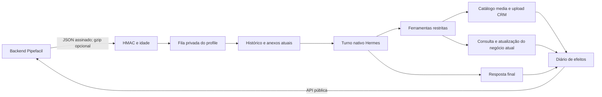

# Runtime HTTP 0.4

Plugin externo ao Pipefacil, instalado na API nativa de plugins do Hermes. Usa webhook/API HTTP;
não usa Kafka, não administra profiles e não modifica o Hermes upstream.



## Entrada e assinatura

`POST /events/message-received`, ou `/p/<profile>/events/message-received` no listener compartilhado.
O backend seleciona eventos conforme agente habilitado, cooldown, negócio/responsável e suas regras
comerciais. Conversas sem negócios abertos e agentes legados sem membro continuam válidos.
O plugin comprova a origem pela assinatura; não substitui essas regras por uma seleção própria.

```json
{
  "type": "message.received",
  "data": {
    "channel": {"id": "channel-id", "phoneNumberId": "sender-id"},
    "contact": {"id": "contact-id", "phone": "+5511999999999", "name": "Cliente"},
    "deal": {"seq": 7},
    "messages": [{
      "id": "message-id", "externalId": "provider-id", "fromMe": false,
      "type": "image", "body": "Veja esta imagem", "timestamp": "2026-10-04T12:00:00Z",
      "media": {"mimeType": "image/jpeg", "filename": "foto.jpg", "downloadUrl": "https://storage.example.org/foto.jpg?signature=temporary"}
    }]
  }
}
```

- `X-PipeFacil-Timestamp`: milissegundos Unix como string decimal, até cinco minutos de diferença.
- `X-PipeFacil-Signature-256`: `sha256=` seguido de 64 caracteres hexadecimais minúsculos.
- `X-PipeFacil-Signature-256-Next`: segunda assinatura opcional durante rotação.
- HMAC-SHA256 com segredo **literal UTF-8** sobre `timestamp + "." + JSON original UTF-8`.
- O Java assina antes do gzip, usado acima de 1024 bytes. Não assine o gzip nem reserialize JSON.
- O listener próprio recebe gzip bruto; o compartilhado pode entregar bytes já descompactados.
  Ambos autenticam exatamente o JSON original. JSON com chaves duplicadas/números inválidos,
  compactação truncada/membros extras e conteúdo fora dos limites são rejeitados.

O segredo no profile não leva prefixo `sha256=`, não é uma assinatura capturada de uma requisição
e não deve ser convertido de hexadecimal/base64. O `=` de `.env` separa variável e valor.
Um 401 no webhook indica assinatura/horário; um 401 na API de saída indica `PIPEFACIL_API_KEY`.
Essas duas credenciais são diferentes.

| HTTP | Resultado |
|---|---|
| 200 | `accepted` com `job_id`: job e recibos admitidos atomicamente |
| 200 | `duplicate`, sem executar novamente, ou `ignored`, sem mensagem recente/evento suportado |
| 400 | `invalid_json`/`invalid_gzip` |
| 401 | `invalid_timestamp`/`expired_signature`/`invalid_signature` |
| 403 | `channel_not_allowed`, quando configurado pelo operador |
| 409 | identidade reutilizada com conteúdo diferente |
| 413/415 | limite excedido/compactação não suportada |
| 422 | contato/mensagens ausentes ou lote com mais de 100 mensagens |
| 429 | fila cheia; admissão desfeita; `Retry-After: 5` |
| 503 | gateway, armazenamento ou segredo indisponível |

`accepted` confirma admissão persistente; não confirma execução do modelo nem entrega no WhatsApp.
Limites: 1 MiB de corpo transportado, 4 MiB após gzip, cinco minutos de idade da mensagem por padrão
e até 30 segundos no futuro. O horário de uma entrega nova não torna uma mensagem antiga recente.

## Configuração por profile

| Variável | Padrão/função |
|---|---|
| `PIPEFACIL_API_KEY` | Obrigatória; API pública da workspace do agente |
| `PIPEFACIL_WEBHOOK_SECRET` | Obrigatório; segredo original do agente, sem prefixo |
| `PIPEFACIL_WEBHOOK_SECRET_NEXT` | Opcional; segredo seguinte para rotação |
| `PIPEFACIL_API_BASE_URL` | `https://pipefacil-server.matchsales.com.br`; origem sem caminho |
| `PIPEFACIL_HOST` / `PIPEFACIL_PORT` | `127.0.0.1` / `8645` no listener próprio |
| `PIPEFACIL_WEBHOOK_PATH` | `/events/message-received` |
| `PIPEFACIL_CHANNEL_IDS` | Lista opcional de IDs separados por vírgula |
| `PIPEFACIL_MEMBER_USER_ID` | userId do responsável do agente; habilita mutações |
| `PIPEFACIL_WRITABLE_FIELDS` | `notes,customFields,stageId,lostReason` |
| `PIPEFACIL_CUSTOM_FIELDS` | Nenhum por padrão; slugs permitidos separados por vírgula |
| `PIPEFACIL_STAGE_IDS` | Nenhuma por padrão; IDs de etapas permitidas separados por vírgula |
| `PIPEFACIL_QUEUE_CAPACITY` / `PIPEFACIL_QUEUE_PER_CHAT` | 500 / 50 jobs aguardando ou processando |
| `PIPEFACIL_CONCURRENCY` | 4 conversas simultâneas |
| `PIPEFACIL_TURN_TIMEOUT_SECONDS` | 600; intervalo 10–3600 |

Opções equivalentes em `platforms.pipefacil.extra` também são aceitas; env tem prioridade.
`history_limit` (100, máximo 200), `max_message_age_seconds` (300, 1–3600) e `reset_allowed_users`
continuam no YAML. Reinicie o gateway após alterar configuração/credenciais.
O userId é a identidade de conta usada em `responsibleUserId`, não o id da linha de membership.
Sem userId configurado, conversas seguem disponíveis e mutações ficam desabilitadas.

## Mídia

| Operação | Comportamento |
|---|---|
| Imagem recebida | Download validado → `MessageEvent` → visão nativa configurada no Hermes |
| Áudio recebido | MIME/assinatura validados; `MessageType.VOICE` ativa STT nativo |
| Documento recebido | Disponível pela leitura restrita; extração nativa do formato |
| Arquivo fixo para envio | `media/` → catálogo de IDs → upload CRM → link temporário → envio |
| URL legada para envio | URL HTTPS exata registrada no SOUL do próprio profile |
| Anexo do histórico | Não é baixado; contexto informa conteúdo não textual |

Configure visão/STT no Hermes. Falhas não autorizam o agente a afirmar que analisou o conteúdo.
Esta versão envia texto, imagens e documentos. Geração de novos arquivos e envio de áudio/vídeo
não são expostos ao modelo; materiais fixos são colocados pelo operador no profile.
Use `knowledge/` para referências de consulta e `media/` para a biblioteca de envio.

Recebimento: HTTPS público, sem redirecionamentos/proxies, DNS validado e IP fixado na conexão,
25 MiB por arquivo, cinco anexos por lote. Cache por 24 horas, limpo na manutenção.
Envio: até 200 itens, 16 MiB por arquivo, sem symlinks/hardlinks, arquivos ocultos ou caminhos
arbitrários. `pipefacil_list_media` retorna IDs; `pipefacil_send_messages` aceita `fileId`.
`POST /api/v1/custom-fields/upload` usa a API existente, com cache por profile, origem/chave da API
e hash do conteúdo. `GET /api/v1/custom-fields/file` renova o link de uma hora antes de enviar.
O object storage do CRM deve emitir HTTPS. Até duas mensagens preliminares são permitidas por turno;
a resposta final automática reutiliza textos já aceitos quando o conteúdo é exatamente igual.

## Ordem e recuperação

`channelId:phone` identifica a conversa, com sessão nativa isolada pelo profile. Cada turno mantém
contato, destino, negócio, anexos e job próprios. A fila começa antes do histórico/downloads e
espera conclusão e limpeza da tarefa nativa antes de avançar. Outra conversa pode progredir em paralelo.
Timeout/desconexão revogam as ferramentas e interrompem o turno nativo. Falha em interromper retira prontidão.

A admissão grava recibos e job na mesma transação. Somente jobs nunca iniciados e ainda recentes são
recuperados. Jobs iniciados antes de uma queda ficam `interrupted`; jobs vencidos na fila ficam
`expired`. Nenhum turno iniciado é repetido automaticamente. Preserve `pipefacil-state/` no volume.

Envio/PATCH/upload gravam intenção antes de HTTP. Sucesso salva recibo verificável; repetição do
mesmo efeito reutiliza o resultado. Exceção de rede, resposta inválida ou resultado incerto não
provoca segunda escrita automática. A API de conversas não oferece idempotência de servidor;
o diário evita repetições locais, sem garantir entrega exatamente uma vez. Aceitação da API não
é confirmação de entrega no dispositivo. Novas mensagens do cliente podem continuar a conversa.

`pipefacil_current_deal` verifica contato/responsável e devolve apenas campos/etapas permitidos.
PATCH usa o negócio do turno, valida propriedades e confirma por GET autorizado. O modelo não escolhe
workspace, destinatário ou outro negócio. O backend continua responsável por autorização atômica.

## Saúde e reconciliação

`GET <callback>/health` informa prontidão, erro fatal, contadores, workers e estados de jobs/efeitos.
HTTP 503 indica indisponibilidade local ou handler nativo ausente. Não comprova conectividade do
WhatsApp nem expõe clientes/credenciais. Examine efeitos `uncertain` separadamente.

```bash
python state_cli.py --profile /caminho/do/profile status
python state_cli.py --profile /caminho/do/profile uncertain
# Pare o gateway deste profile; use prova externa real para reconciliar.
python state_cli.py --profile /caminho/do/profile reconcile --action <id> \
  --outcome accepted --receipt /caminho/recibo-verificado.json \
  --evidence 'Mensagem localizada no histórico do canal; id confirmado'
```

Recibo: `{"message_id":"id","status":"accepted"}` para envio, `{"key":"storage-key"}` para upload
ou `{"updated":true}` para alteração comprovada. `--outcome not_performed` registra que a ação não
ocorreu. Reconciliação mantém evidência e não repete turno/envio. Lock exclusivo recusa alterações
com o gateway ativo. Diretório 0700, journal 0600. Dados de jobs/recibos encerrados são removidos em
sete dias; efeitos incertos mantêm referências até resolução, sem preservar o webhook além desse prazo.

## Testes locais

Execute dentro de um Hermes não modificado. A CI cobre imagem oficial e upstream atual:

```bash
PLUGIN_DIR=/caminho/hermes-pipefacil-plugin
HERMES_SOURCE=/caminho/hermes-agent
cd /tmp
PYTHONPATH="$HERMES_SOURCE:$PLUGIN_DIR/tests" \
  "$HERMES_SOURCE/.venv/bin/python" -m pytest --import-mode=importlib "$PLUGIN_DIR/tests" -q
```

Os testes determinísticos usam credenciais falsas e servidores locais. Cobrem sockets, gzip em
ambos os listeners, lifecycle nativo, ordenação, fila, multipart, isolamento e efeitos. Testes com
modelo, CRM e canal reais exigem profiles isolados, credenciais privadas e contatos de teste.
As evidências devem distinguir aceitação da API de entrega real no WhatsApp.

### Autorização de contatos

O backend já seleciona o agente e verifica a conversa antes de assinar o webhook. O adapter
usa a delegação de autorização do Hermes somente para essa entrada autenticada. Clientes não
precisam de pairing ou de cadastro individual no gateway. O segredo é obrigatório em todos os
callbacks; use `PIPEFACIL_CHANNEL_IDS` para restringir também o canal. Pedidos de administração
continuam bloqueados, e alterações de CRM conferem o responsável atual via API.

A callback `is_connected` da registry do Hermes é uma consulta de configuração usada antes da
criação do adapter; `/health` fornece a prontidão real do processo. Valores de host/porta/path
explícitos no YAML são preservados. Rode pelo comando normal `hermes gateway run`, que carrega o
ambiente e descobre plugins antes de iniciar o gateway.
